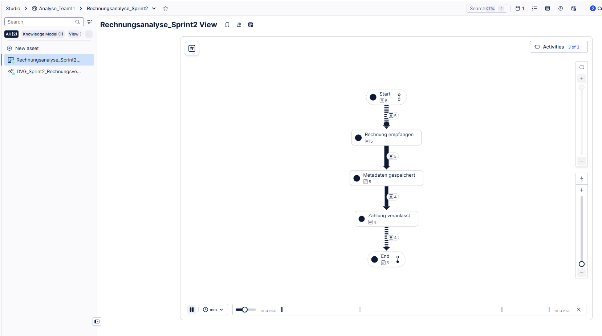
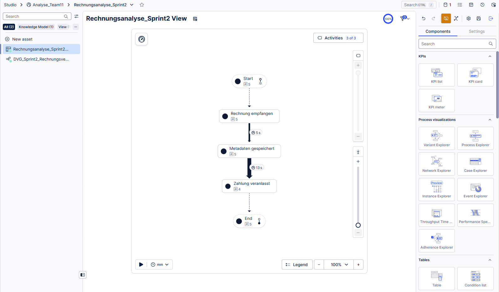

# Projektbericht Sprint 2 - Team 11

## 1. Prozess-Varianten
In der Celonis-Analyse wurden 5 Rechnungen (Cases) untersucht.
- **Ergebnis:** Es gibt 2 Varianten.
- **Beobachtung:** 4 Rechnungen durchliefen den Prozess vollständig (100% Erfolg). 
- **Abweichung:** Eine Rechnung endete vorzeitig nach "Metadaten gespeichert". Dies simuliert einen Abbruch im Zahlungssystem.

*Abbildung 1: Darstellung der Prozessvarianten im Celonis Process Explorer*

---

## 2. Bottleneck-Analyse
Die Analyse der Durchlaufzeiten (Throughput Time) ergab:
- **Engpass:** Der Schritt zwischen "Metadaten gespeichert" und "Zahlung veranlasst".
- **Dauer:** Durchschnittlich **13 Sekunden**.
- **Begründung:** Die Verzögerung entsteht durch die asynchrone Kommunikation via RabbitMQ und die simulierte Verarbeitungszeit im `payment_system`.

*Abbildung 2: Identifikation des Engpasses durch Durchlaufzeit-Analyse*